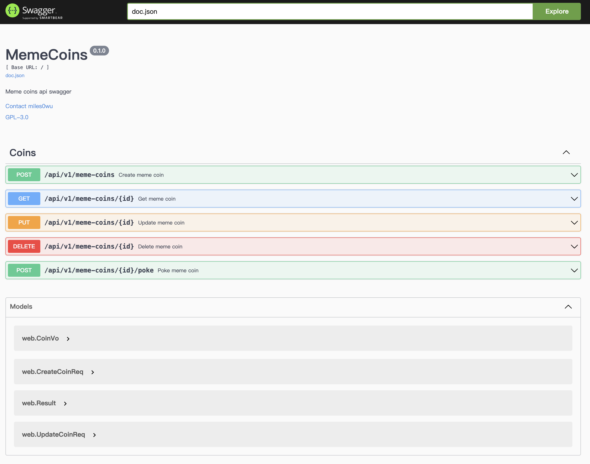
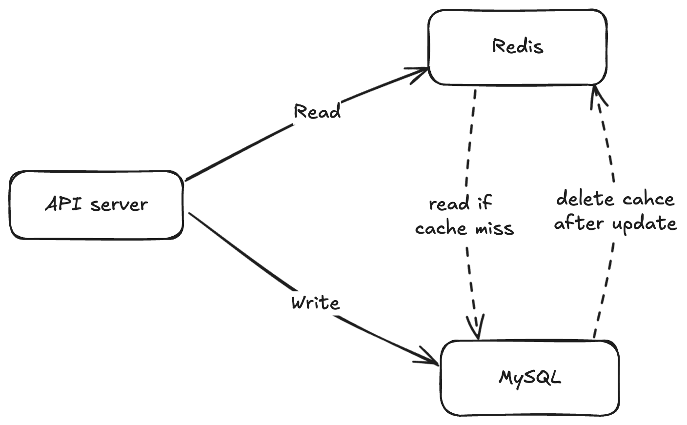
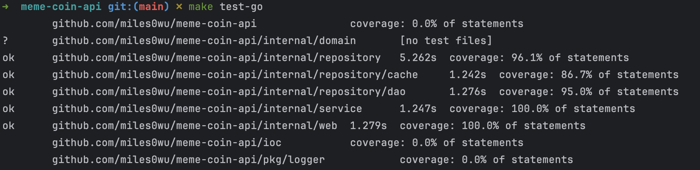

# Meme Coin API

A RESTful API implementation for managing meme coins.

## Description
The Meme Coin API provides a collection of HTTP endpoints to perform operations on meme coin resources. It includes the following functionalities:
1. **Create Meme Coin**: Add a new meme coin.
2. **Get Meme Coin**: Retrieve the details of a meme coin by its ID.
3. **Update Meme Coin**: Modify the description of a meme coin using its ID.
4. **Delete Meme Coin**: Remove a meme coin by its ID.
5. **Poke Meme Coin**: "Poke" a meme coin to show your interest, which increments its popularity score.

---

## Running the Application
### Running With Docker Compose (**Recommend**)
To start the application, simply run the following command :

```sh
make dev
```

This will:
  - Compile the code.
  - Build the Docker image.
  - Pull necessary third-party dependencies (such as MySQL and Redis).
  - Launch all services.

Configuration settings are defined in `config/config.yaml`, with volume mounts specified in `docker-compose.yml`. The default configuration is ready to use, but you can modify it as needed.

### Running Locally
You can also run it locally, but please ensure that the current environment and configuration settings are consistent:
```sh
go run main.go --config=./config/dev.yaml
```

---

## Accessing the API
- The API server listens on **port 8080** by default.
- You can access it at:

    http://localhost:8080
- Swagger API documentation is available at:

    http://localhost:8080/api/docs/index.html



### System Architecture
- **MySQL** is used as the primary database for persistent storage.
- **Redis** is integrated as a caching layer to improve performance.



---

## Project layout
This project follows the **Domain-Driven Design (DDD)** architecture to maintain a modular and scalable code structure. Below is an overview of the key directories:
```
.
├── api              # API documentation (Swagger files)
├── config           # Configuration files
│
├── internal         # Core business logic (follows DDD principles)
│ ├── domain         # Domain entities and aggregates
│ │
│ ├── repository     # Data access layer (DAO & cache)
│ │ │
│ │ ├── cache        # Caching implementation
│ │ │
│ │ └── dao          # Database operations
│ │
│ ├── service        # Application services (business logic)
│ │ 
│ └── web            # HTTP handlers (presentation layer)
│
├── ioc              # Dependency injection (initialize components)
│ 
├── pkg              # Utility packages (shared components)
│ 
├── script           # Shell scripts for automation
│ 
├── Dockerfile       # Docker build configuration
├── main.go          # Application entry point
└── wire.go          # Dependency injection definitions (wire)

```
This project is structured using **Domain-Driven Design (DDD)** principles:

- **`internal/domain`**: Defines the core domain models (entities, aggregates).
- **`internal/repository`**: Implements data access logic, including database (DAO) and caching (Cache).
- **`internal/service`**: Contains business logic and orchestrates interactions between domain models and repositories.
- **`internal/web`**: Serves as the presentation layer, handling HTTP requests and API responses.
- **`ioc/`**: Manages dependency injection for databases, caches, and logging.

This modular approach ensures **high maintainability, testability, and scalability**. Each layer has a clear responsibility, making it easier to extend and modify.

---

## Running tests
To execute all unit tests, run:
```
make test-go
```

